# 📊 PostgreSQL — Домашнее задание №3  
Группировка данных и оконные функции


---

## Содержание

- [Описание проекта](#описание-проекта)
- [Структура репозитория](#структура-репозитория)
- [Краткое описание данных](#краткое-описание-данных)
- [Задачи 1–8](#задачи-1–8)
  - [Задача 1 — распределение клиентов по сферам](#задача-1)
  - [Задача 2 — доход по месяцам и сферам](#задача-2)
  - [Задача 3 — онлайн-заказы IT-клиентов по брендам](#задача-3)
  - [Задача 4 — общие метрики по клиентам (GROUP BY и оконные функции)](#задача-4)
  - [Задача 5 — топ-3 минимальных и топ-3 максимальных клиентов](#задача-5)
  - [Задача 6 — вторые транзакции клиентов](#задача-6)
  - [Задача 7 — максимальный интервал между заказами](#задача-7)
  - [Задача 8 — топ-5 клиентов в каждом wealth-segment](#задача-8)

---

# Описание проекта

Домашнее задание посвящено работе с агрегирующими запросами, подзапросами и оконными функциями в PostgreSQL.  

Все задания выполняются на тех же таблицах, что и в предыдущей работе:

- customer  
- orders  
- order_items  
- product  

Основная цель — применить оконные функции для ранжирования, вычисления интервалов и предварительных агрегаций.

---

# Структура репозитория

```
DB3_homework/
│
├── sql/
│ └── Вайс_Федор_ДЗ3.sql
│
└── img/
  ├── T1.png
  ├── T2_начало.png
  ├── T2_конец.png
  ├── T3.png
  ├── T3_проверка.png
  ├── T4_1.png
  ├── T4_2.png
  ├── T5.png
  ├── T6.png
  ├── T7.png
  └── T8.png

```  
---

# Краткое описание данных

Все данные относятся к одному году — 2017.  
Связи между таблицами:

- customer (1) — (∞) orders  
- orders (1) — (∞) order_items  
- product (1) — (∞) order_items  

Схема аналогична ДЗ №2, поэтому повторно ERD не строилась.

---

# Задачи 1–8

## Задача 1  
Вывести количество клиентов по сферам деятельности, отсортировать по убыванию.

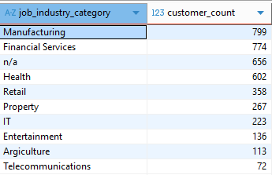

---

## Задача 2  
Найти сумму дохода для подтвержденных заказов по каждому месяцу и сфере.

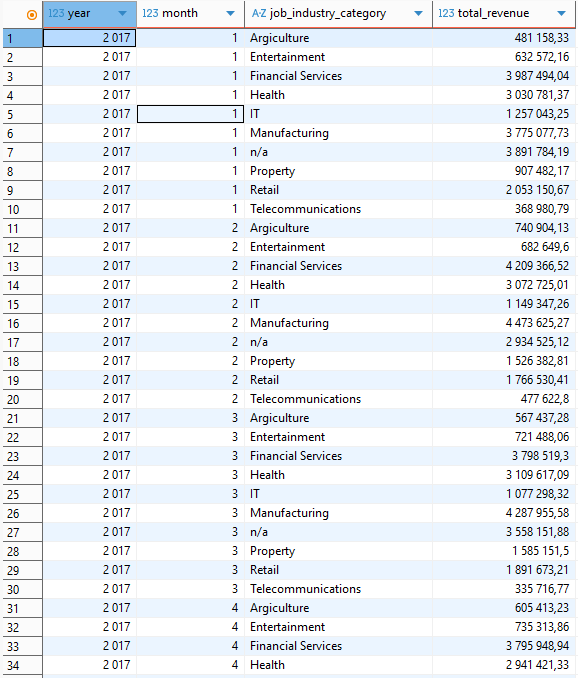  
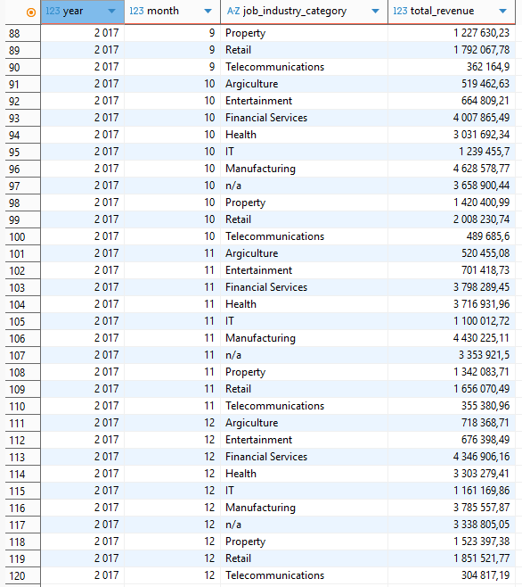

---

## Задача 3  
Посчитать количество уникальных онлайн-заказов (Approved) клиентов из IT по каждому бренду.  
Включить бренды без заказов (у них значение равно 0).

Код учитывает этот случай через LEFT JOIN + CASE.

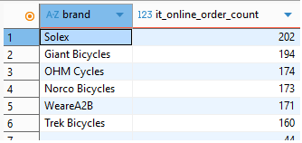  
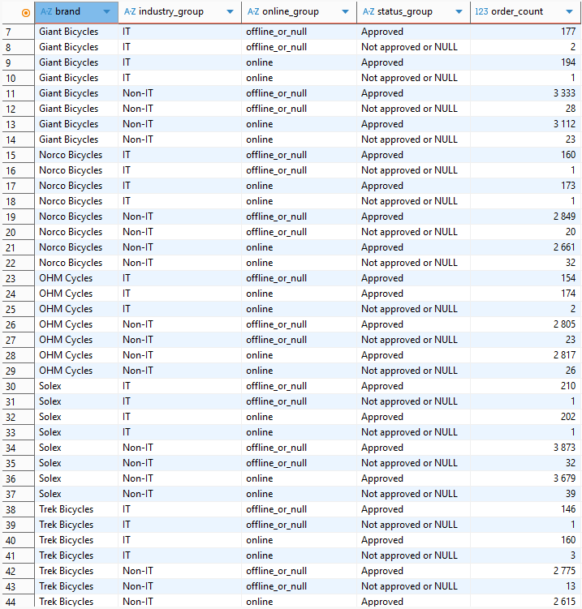

---

## Задача 4  
Найти сумму, максимум, минимум, количество и среднюю сумму заказов по каждому клиенту.  
Выполнить двумя способами:

- через GROUP BY  
- через оконные функции  

Оба варианта дают одинаковый результат.

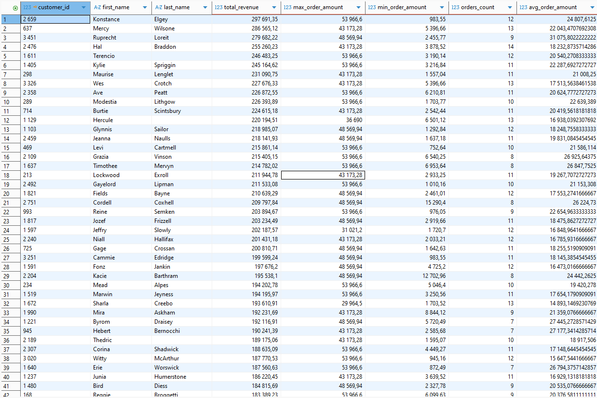  
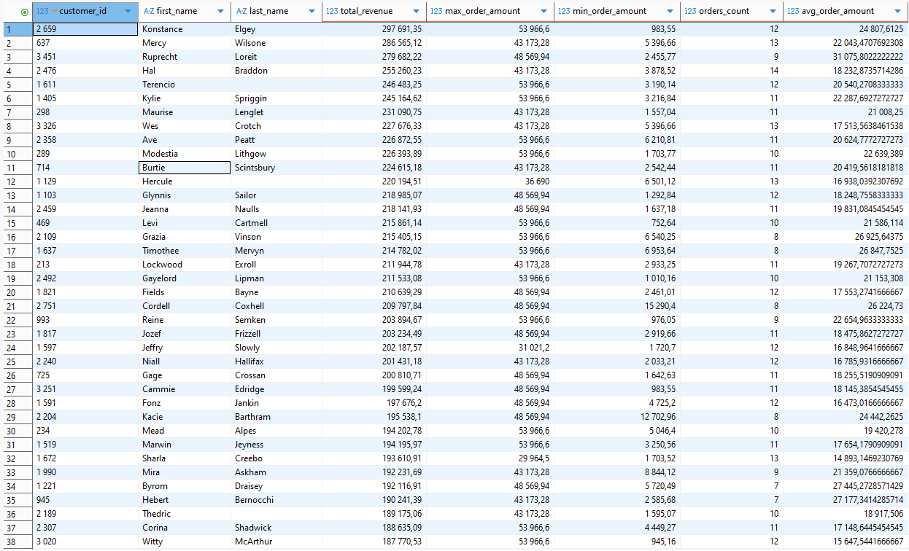

---

## Задача 5  
Вывести топ-3 клиентов с минимальной суммой транзакций (0 у многих).  
Вывести топ-3 клиентов с максимальной суммой транзакций.  
Учесть клиентов без заказов.

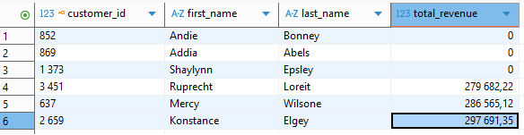

---

## Задача 6  
Вывести только вторые транзакции клиентов.  
Клиенты с одним заказом не включаются.

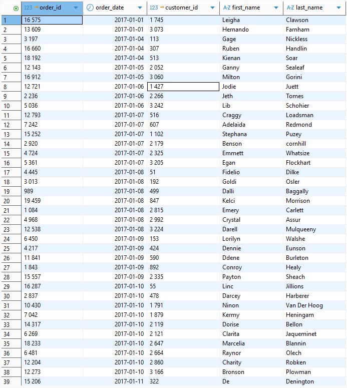

---

## Задача 7  
Посчитать максимальный интервал (в днях) между двумя соседними заказами каждого клиента.  
Исключить клиентов с ≤1 заказом.

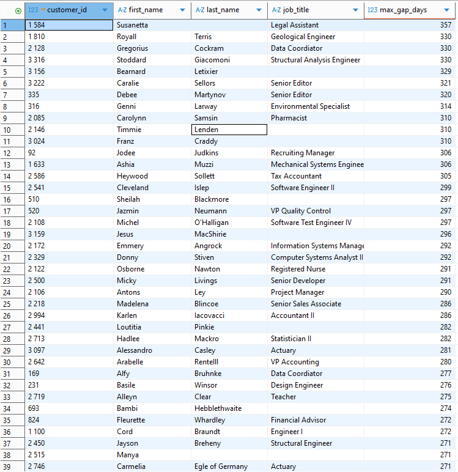

---

## Задача 8  
В каждом сегменте wealth_segment выбрать топ-5 клиентов по общему доходу.  
Если клиентов меньше 5 — вывести всех.

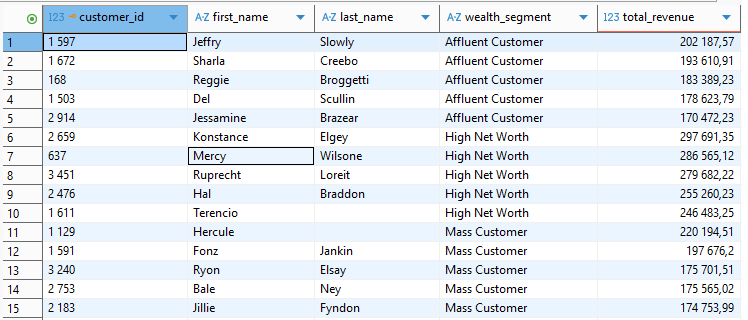

---

# Итог

- выполнены все 8 задач  
- результаты проверены на корректность  
- использованы оконные функции, группировки и подзапросы  
- учтены нюансы каждой формулировки  
- структура репозитория подготовлена для проверки

